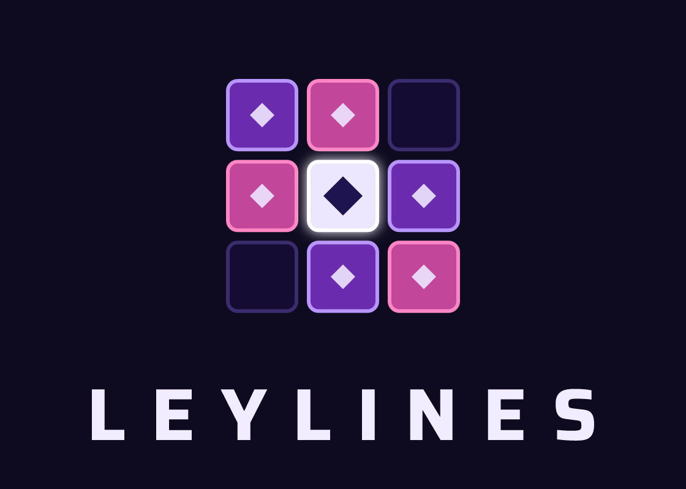

<h1 align="center">
  <picture>
    <source media="(prefers-color-scheme: dark)" srcset="client/images/leylines-vertical.svg">
    
  </picture>
</h1>

<p align="center">
  A card game of nine squares: a 3×3 card game in the style of Triple Triad (Final Fantasy VIII), with 55 original cards.
</p>

<p align="center">
  <a href="https://yousifalsaeed.github.io/Leylines/"><b>▶ Play online</b></a>
</p>

---

## How to play

Each player brings **5 cards**. You take turns placing one card on the **3×3 board**.

- Every card has 4 numbers: top, right, bottom and left. **A** means 10.
- When you place a card next to an enemy card and your touching side is **higher**, that card flips to your colour.
- When the board is full, your score is the cards you own on the board plus the cards still in your hand. The **higher score wins**.

The in-game **How to play** screen shows every rule with an animated example.

## Game modes

| Mode | Description |
| --- | --- |
| **vs Computer** | Play the CPU on Easy, Normal or Hard. Hard searches ahead with minimax. |
| **Same Screen** | Two players on one device. |
| **Online** | Play a friend over the internet. The host gets a 5-letter code and an invite link to share. |

## Rules

Each rule can be turned on or off in match setup.

| Rule | What it does |
| --- | --- |
| **Open** | Both hands are played face up. |
| **Same** | When two or more sides of your card equal the touching sides of the cards next to it, those enemy cards flip. |
| **Same wall** | The board edge counts as an A (10) for Same. |
| **Plus** | When two or more touching pairs add up to the same total, those enemy cards flip. |
| **Combo** | Cards flipped by Same or Plus then flip their weaker enemy neighbours, and it can keep chaining. |
| **Elemental** | 1 to 4 squares get an element. A card of the same element gets +1 on every side; any other card gets −1. |
| **Sudden death** | A draw restarts the match. Each player keeps the cards they owned at the end (up to 5 extra rounds). |
| **Random** | Your 5 cards are dealt at random from your collection. |
| **Turn timer** | Off, or 10 to 90 seconds per turn. When time runs out, a random card is played to a random empty square. |

## Trade rules

The trade rule decides which cards the winner takes from the loser.

| Trade | The winner takes |
| --- | --- |
| **None** | Nothing. It's a friendly match. |
| **One** | 1 card of their choice. |
| **Diff** | As many cards as the score difference (max 5). |
| **All** | All 5 of the loser's cards. |
| **Sweep** | All 5 cards, but only after owning every square on the board. Any other win trades nothing. |

## Cards and collection

The 55 cards are split into five rarities:

| Rarity | Cards |
| --- | --- |
| 1★ Common | 14 |
| 2★ Uncommon | 14 |
| 3★ Rare | 11 |
| 4★ Epic | 8 |
| 5★ Legendary | 8 |

- You start with 9 weak cards and win better ones in matches.
- **Deck limits:** a deck can have at most **1 card of 5★** and at most **2 cards of 4★ or more**.
- Save up to 3 hands as loadouts, or let **Best 5** pick your strongest legal hand.
- Browse your cards in the **Collection** binder, with one section per rarity.
- **Settings → Unlock all cards** lets you play with every card without touching your collection.

## Settings

- **Theme:** System, Dark or Light
- **Music and sound effects** volume
- **Unlock all cards:** Off / On
- **Reset progress:** erases your cards and stats

## Accounts

Playing as a guest works exactly as before: progress stays on that device. The profile card on the menu (where Wins / Losses / Draws were) offers **Create account**:

- Sign-up takes a username, a password (8+ characters) and an optional email. Your current cards, stats, hands and settings are uploaded to the new account.
- Signed in, every change syncs to the account a couple of seconds later. The card shows *Synced*, *Syncing…* or *Offline*.
- Signing in on a device that already has different progress asks **which progress to keep**. A device that was never played just loads the account.
- If two devices both change progress before syncing, the next sync asks the same question instead of overwriting.
- **Settings** shows the account at the top, with **Sign out**. Signing out keeps the progress on that device.
- **Reset progress** while signed in also resets the account.

There's no password reset yet; the email is stored for when there is.

## Running locally

**Just the game:** open `client/index.html` in any modern browser. There's no build step and nothing to install.

**With the server** (Node 20+), which serves the game plus the `/api` routes and the database:

```bash
npm install
npm start
```

Then open http://127.0.0.1:3000. `npm run dev` restarts on file changes, `npm run db:init` creates the database without starting the server. `PORT`, `HOST` and `DB_FILE` can be set as environment variables.

Game progress is saved in the browser's `localStorage`. Accounts (below) need the server; without it the game runs as guest only.

An internet connection is needed for:
- the fonts (Saira and Geist, from Google Fonts)
- **Online** mode, which loads [PeerJS](https://peerjs.com/) from a CDN and connects players peer to peer

## Project structure

```
client/                 the game: static files, no build step
  index.html            markup for every screen
  css/                  styles, one file per area (base, menu, cards, game, howto, collection, online)
  js/                   scripts, loaded in order as plain <script> tags sharing one global scope:
    data.js             cards, rules, trades
    save.js             localStorage save
    helpers.js          DOM helpers, audio, layout
    engine.js           pure game rules (used by the UI, the AI and online sync)
    ai.js               computer opponent
    menu.js setup.js deck.js match.js game.js collection.js howto.js settings.js online.js
    account.js          sign up / sign in, the menu's profile card, cloud save sync
                        one file per screen or feature
    main.js             boot: runs last, starts the app
  audio/ images/        music, logos, favicon and app icons
server/                 optional Node server (Express)
  index.js              entry point
  app.js                static files + /api
  routes/auth.js        POST /api/auth/signup, /login, /logout
  routes/me.js          GET /api/me, PUT /api/me/save (the cloud save)
  routes/users.js       GET /api/users/:username (public profile)
  lib/                  password hashing (scrypt), sessions, rate limiting, field checks
  db/index.js           picks the database: Postgres if DATABASE_URL is set, else SQLite
  db/postgres.js        Postgres (Neon in production)
  db/sqlite.js          SQLite via sql.js (WebAssembly, no native build), for local use
  db/schema.*.sql       tables: users, sessions, user_saves (one file per database, kept in step)
  data/                 the local SQLite file (git-ignored)
index.html              forwards to client/ (for GitHub Pages "deploy from branch")
render.yaml             Render Blueprint for the dev branch
```

A new script goes before `main.js` in `client/index.html`. Code that runs at load time (not inside a function) can only use things defined in earlier files.

## API

All under `/api`, JSON in and out. Signed-in requests send `Authorization: Bearer <token>` (tokens last 60 days of inactivity; only their SHA-256 is stored).

| Route | Does |
| --- | --- |
| `POST /auth/signup` | `{ username, password, email?, displayName?, save? }` → `{ token, user, save }` |
| `POST /auth/login` | `{ username, password }` → `{ token, user, save }` (save includes `data`) |
| `POST /auth/logout` | Ends this session |
| `GET /me` | `{ user, save: { data, rev, updatedAt } \| null }` |
| `PUT /me/save` | `{ data, baseRev, force? }` → `{ rev, updatedAt }`, or **409** if another device saved since `baseRev` |
| `GET /users/:username` | Public profile |
| `GET /health` | `{ ok: true }` |

Sign-up and sign-in are limited to 20 attempts per 15 minutes per IP.

Server settings (environment variables): `PORT`, `HOST`, `DATABASE_URL` (Postgres connection string; when empty a local SQLite file at `DB_FILE` is used), `CORS_ORIGINS` (comma-separated, default `*`), `TRUST_PROXY` (set to `1` behind Render or another proxy), `SESSION_DAYS`.

If the client is hosted somewhere other than the server (for example GitHub Pages), set `<meta name="leylines-api" content="https://your-server">` in `client/index.html`.

## Deployment

The game is hosted on GitHub Pages: https://yousifalsaeed.github.io/Leylines/

- **Settings → Pages → Source: GitHub Actions** (recommended): `.github/workflows/pages.yml` publishes `client/` as the site root on every push to `main`.
- **Deploy from a branch** (`main`, root): the root `index.html` forwards to `client/`, keeping `?join=` invite codes.

GitHub Pages only serves static files, so the server is not deployed there. It needs a Node host of its own.

### Render (dev branch)

`render.yaml` describes the service: in the Render dashboard choose **New → Blueprint** and pick this repository. It deploys the `dev` branch (game and API on one URL) and redeploys on every push to `dev`.

Accounts are stored in a free [Neon](https://neon.tech) Postgres database, because Render's free plan wipes the server's disk on every deploy, restart and idle spin-down (after 15 minutes without traffic). To set it up:

1. Create a Neon project and copy its connection string (`postgresql://...?sslmode=require`).
2. In Render: the service → **Environment** → add `DATABASE_URL` with that string, then save (Render redeploys).
3. The server creates the tables on start. The log line `Leylines running ... (database: postgres)` confirms it's connected.

Without `DATABASE_URL` the server uses a SQLite file, which is fine locally but on Render loses accounts at every spin-down. The first visit after a spin-down takes about a minute.

